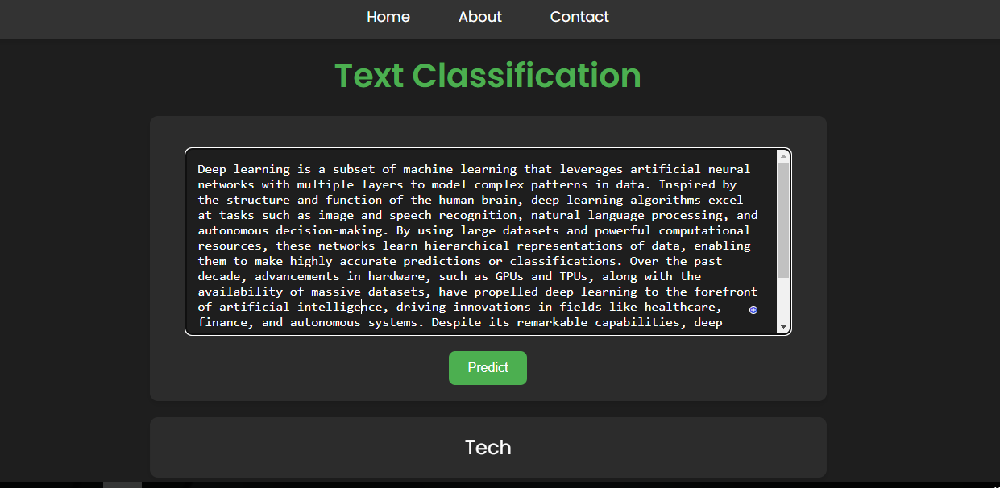

# Multiclass Text Classification Project

## Project Overview
The goal of this project is to classify text data into predefined categories using a combination of traditional machine learning models and deep learning architectures. The project includes:
- A **Flask-based web application** for interactive text classification.
- **Preprocessing** of text data, including cleaning, tokenization, and lemmatization.
- Training and evaluation of multiple models, including:
  - Traditional ML models: Logistic Regression, SVM, Naive Bayes, Random Forest, Gradient Boosting, AdaBoost, and an Ensemble model.
  - Deep learning models: LSTM, GRU, CNN, and a hybrid LSTM+CNN model.
  - Fine-tuning of transformer-based models: BERT and XLNet using **ktrain**.
- Visualization of results, including confusion matrices, accuracy plots, and word clouds.

---

# Requirements:

* Python 

* Scikit-learn

* TensorFlow 

* Keras

# Dataset:

The dataset used in this project is the bbc-tex dataset, which consists of approximately 2225 text.

# Results:
The results of each model on the bbc-text dataset are as follows:

|  Model | Accuracy |
|----------|----------|
| Logistic Regression | 96.58% |
| Support Vector Machine | 96.94% |
| Multinomial Naive Bayes | 94.97% |
| Randomforest | 95.15% |
| GradientBoostingClassifier | 94.25% |
| Ensemble Classifier | 97.12% |
| AdaBoost | 94.43% |
| LSTM 1-Layer | 99.22% |
| LSTM 2-Layers | 97.78% |
| GRU | 91.74% |
| CNN+LSTM | 98.73% |
| BERT | 99.60% |
| XLNet | 99.46% |

# Application Interface

